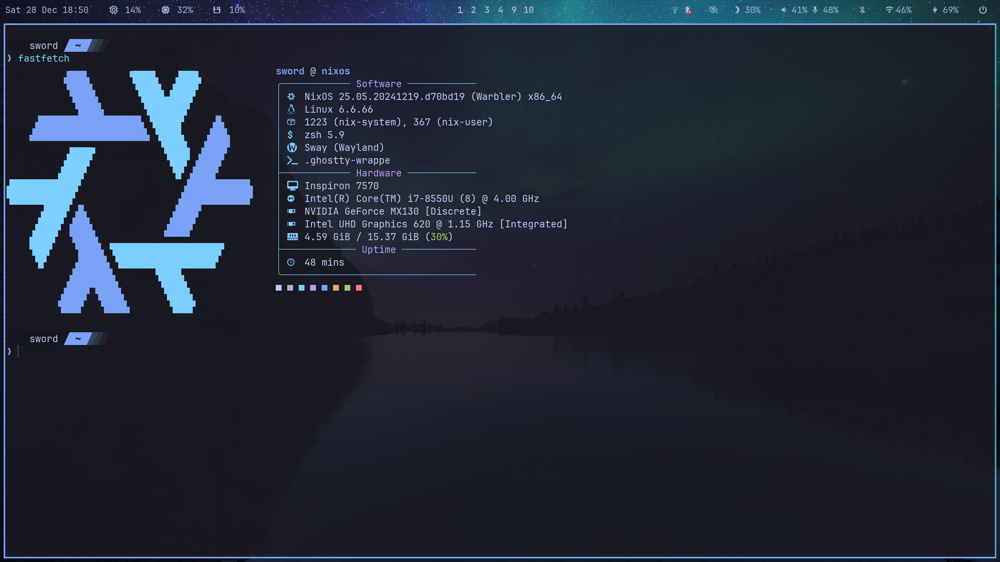

# About

---

## Current topics of interest

- Deep learning framework internals (JAX, PyTorch Tinygrad)
- LLMs, Transformers and RAG
- Functional programming
- Compiler internals
- WASM (WebAssembly)

## Languages I currently use

- Rust
- Python
- C
- C++

## Languages I am interested in

- OCaml
- Haskell
- Zig

## Current OS

❄️ NixOS
  
  
